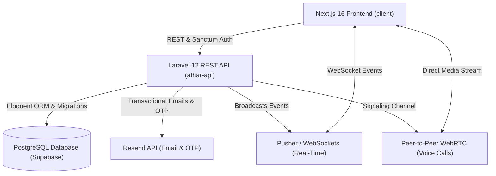

# Khatma & Athar (ختمة وأثر)

<div align="center">

**منصة مجتمعية لتحويل ختمات القرآن الكريم إلى أثر مجتمعي ملموس**  
*Transforming Quranic Completions into Tangible Social Impact*

[](https://laravel.com)
[](https://nextjs.org)
[](https://react.dev)
[](https://supabase.com)
[](https://tailwindcss.com)
[](https://www.typescriptlang.org)
[](https://php.net)
[](https://webrtc.org)

</div>

---

## 🌟 Project Vision & Purpose

**Athar (أثر)** establishes a virtuous cycle of community service inspired by the values of the Holy Quran. Upon completing a Quran recitation (*Khatma*), readers offer voluntary gifts, services, and educational sessions. Community members (*Seekers*) post localized requests for Quranic learning and support. The platform bridges this connection through real-time coordination, WebRTC voice communication, and an interactive **Glow Impact Map**.

---

## 🏗️ System Architecture

The project is structured as a decoupled monorepo containing a full-featured Laravel backend API and a Next.js frontend web application:



### Sub-Projects Overview

- **[Backend API (`athar-api`)](./athar-api)**: Built with **Laravel 12** and **PHP 8.2+**. Manages authentication, role enforcement (`admin`, `khatma`, `seeker`), coordination lifecycles, WebRTC signaling, real-time broadcasts, impact calculations, and spatial grouping. Backed by **PostgreSQL on Supabase**.
- **[Frontend Client (`client`)](./client)**: Built with **Next.js 16.3+ (Pages Router)**, **React 19**, **Tailwind CSS 4**, and **TypeScript**. Features interactive spatial maps (`@vis.gl/react-google-maps` with MapLibre fallback), real-time chat with Laravel Echo, WebRTC voice calling modals, and an ECharts-powered admin analytics dashboard.

---

## 🚀 Key Features

| Feature | Description |
| :--- | :--- |
| 🗺️ **Interactive Impact Map** | Dynamic spatial visualization grouping contributions by city and neighborhood with glowing intensity markers. |
| 🤝 **Two-Sided Marketplace** | Dedicated dashboards for **Khatma Readers** (offering gifts & services) and **Seekers** (posting Quranic community needs). |
| 📞 **WebRTC Voice Calling** | Direct in-browser peer-to-peer audio calls with custom dial tones, incoming call modals, and call history tracking. |
| 💬 **Real-Time Chat & Coordination** | Instant messaging via Pusher WebSockets with integrated "Claim", "Mark Delivered", and "Confirm Fulfillment" actions. |
| 🔔 **Live In-App Notifications** | Header notification bell with unread counters for new messages, participant claims, and status updates. |
| ⭐ **Impact Scoring & Badges** | Automated impact points calculation (`Rating × 2`) updating user profiles and unlocking achievement badges. |
| 🛡️ **Administrative Moderation** | Comprehensive admin control panel (`/admin`) with ECharts platform metrics and management for users, khatmas, needs, reviews, and calls. |
| 🔐 **OTP Email Verification** | Secure 6-digit verification code system powered by Resend transactional mailer. |

---

## 💻 Tech Stack Summary

| Layer | Technologies |
| :--- | :--- |
| **Frontend Framework** | Next.js 16.3 (Pages Router), React 19, TypeScript 5 |
| **Styling & UI** | Tailwind CSS 4, Framer Motion, Lucide React |
| **Mapping** | `@vis.gl/react-google-maps`, MapLibre GL JS (Fallback) |
| **Data Visualization** | Apache ECharts |
| **Backend Framework** | Laravel 12, PHP 8.2+ |
| **Database** | PostgreSQL (Hosted on Supabase via `ext-pdo_pgsql`) |
| **Authentication** | Laravel Sanctum (Token & Ability-Based) |
| **Real-Time WebSockets** | Pusher Channels + Laravel Echo (`pusher-js`) |
| **Voice Calling** | WebRTC PeerConnection + Web Audio API Synthesizer |
| **Email & Delivery** | Resend API (`resend/resend-laravel`) |
| **Testing & Quality** | PHPUnit 11 (99 tests), Laravel Pint, ESLint, Prettier |

---

## 👥 Default Demo & Seed Accounts

When initializing the database via `php artisan migrate:fresh --seed`, the following accounts are pre-configured:

| Role | Name | Email | Password | Access & Capabilities |
| :--- | :--- | :--- | :--- | :--- |
| **Admin** | مدير النظام | `katmaweb@outlook.com` | `SecureAdminPassword123!` | Full access to `/admin` dashboard, analytics & moderation tools |
| **Khatma** | خاتمة | `khatmaweb@gmail.com` | `SecureDemoPassword123!` | Record khatmas, offer gifts, browse & claim community needs |
| **Seeker** | فهدة | `Fhdahfhdah@gmail.com` | `SecureDemoPassword123!` | Create & manage Quranic needs across Riyadh neighborhoods |

*(Default passwords can be customized via `ADMIN_PASSWORD` and `SEED_PASSWORD` in `athar-api/.env`)*

---

## 🛠️ Getting Started

### Prerequisites
- **Node.js**: `18.x` or `20.x+` & `npm`
- **PHP**: `8.2+` with extensions: `pdo_pgsql`, `pdo`, `mbstring`, `openssl`, `curl`
- **Composer**: `2.x+`
- **Supabase Account**: A PostgreSQL database project

---

### Step 1: Backend Setup (`athar-api`)

```bash
# 1. Navigate to API directory
cd athar-api

# 2. Install dependencies
composer install

# 3. Configure environment
cp .env.example .env
php artisan key:generate
```

Configure your Supabase PostgreSQL credentials in `athar-api/.env`:
```env
DB_CONNECTION=pgsql
DB_HOST=aws-0-eu-central-1.pooler.supabase.com
DB_PORT=5432
DB_DATABASE=postgres
DB_USERNAME=postgres.your_project_ref
DB_PASSWORD=your_supabase_database_password
DB_SSLMODE=require

# Frontend & CORS Configuration
FRONTEND_URL=http://localhost:3000
CORS_ALLOWED_ORIGINS=http://localhost:3000,http://127.0.0.1:3000
```

Run database migrations and seed demo data:
```bash
php artisan migrate:fresh --seed
```

Start the Laravel development server:
```bash
php artisan serve
# API is accessible at http://localhost:8000
```

---

### Step 2: Frontend Setup (`client`)

```bash
# 1. Open a new terminal and navigate to client directory
cd client

# 2. Install dependencies
npm install

# 3. Configure environment
cp .env.example .env.local
```

Verify your `.env.local` configuration:
```env
NEXT_PUBLIC_API_BASE_URL=http://localhost:8000/api
NEXT_PUBLIC_APP_NAME=ختمة وأثر
NEXT_PUBLIC_APP_URL=http://localhost:3000

# Optional Google Maps Key (MapLibre is used as automatic fallback)
NEXT_PUBLIC_GOOGLE_MAPS_API_KEY=

# Pusher / WebSocket Configuration
NEXT_PUBLIC_PUSHER_APP_KEY=your_pusher_key
NEXT_PUBLIC_PUSHER_APP_CLUSTER=mt1
NEXT_PUBLIC_PUSHER_SCHEME=https
```

Start the Next.js development server:
```bash
npm run dev
# Frontend is accessible at http://localhost:3000
```

---

## 🧪 Testing & Code Quality

### Backend Tests (Laravel)
```bash
cd athar-api
# Run feature, unit, and authorization tests
php artisan test

# Format code with Laravel Pint
vendor/bin/pint
```

### Frontend Quality Checks (Next.js)
```bash
cd client
# Run ESLint and TypeScript checks
npm run lint

# Format frontend code
npm run format
```

---

## 📁 Repository Structure

```
athar_khatma/
├── README.md               # Root project overview & architecture (this file)
├── athar-api/              # Laravel 12 Backend API
│   ├── app/                # Models, Http Controllers, Middleware, Resources
│   ├── config/             # App, auth, database, and broadcasting configs
│   ├── database/           # Migrations, Seeders & Factories
│   ├── routes/             # api.php, web.php, channels.php (Broadcasting)
│   ├── tests/              # Feature & Unit test suite (99 tests)
│   └── README.md           # Backend-specific documentation & API reference
└── client/                 # Next.js 16.3 Frontend Application
    ├── src/
    │   ├── components/     # UI components, Admin panels, WebRTC Call modals, Maps
    │   ├── context/        # AuthContext and CallContext state providers
    │   ├── pages/          # Pages Router (Landing, Auth, Dashboard, Needs, Chat, Admin)
    │   └── services/       # Typed API client, WebRTC service, Echo WebSockets
    └── README.md           # Frontend-specific documentation & route guide
```

---

## 📄 License & Attribution

This project is open-source and built for social good. Feel free to contribute or adapt for charitable community initiatives.

